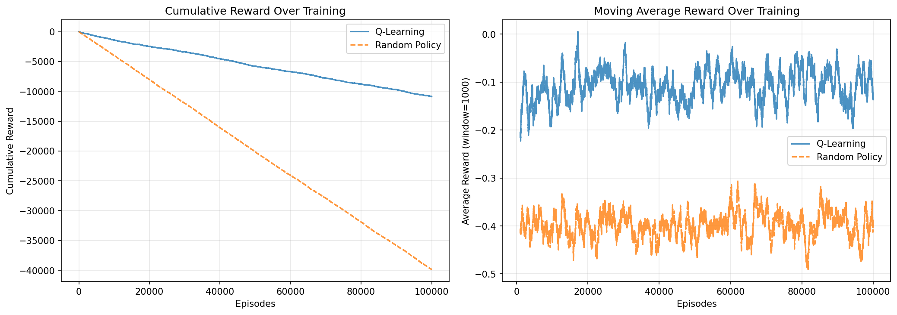
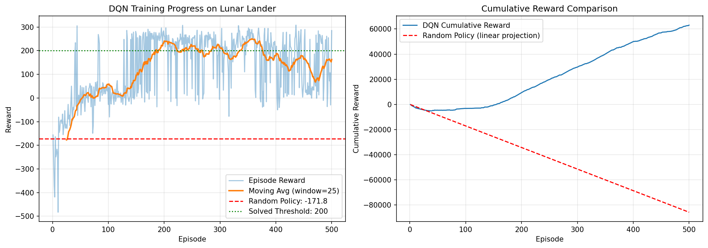
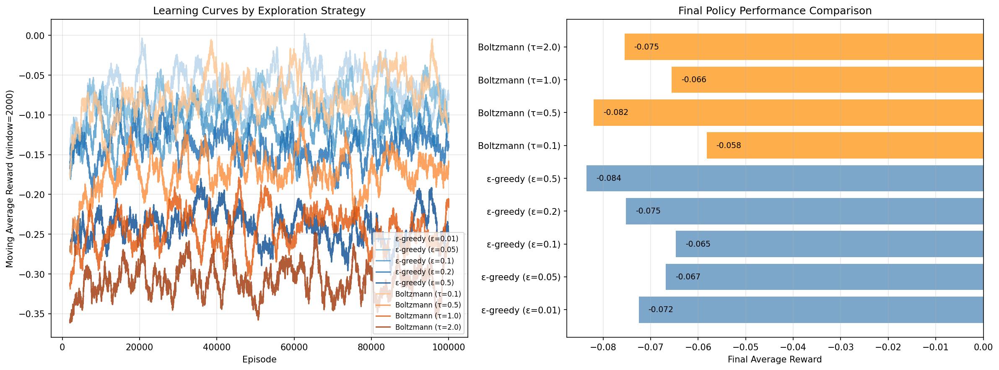
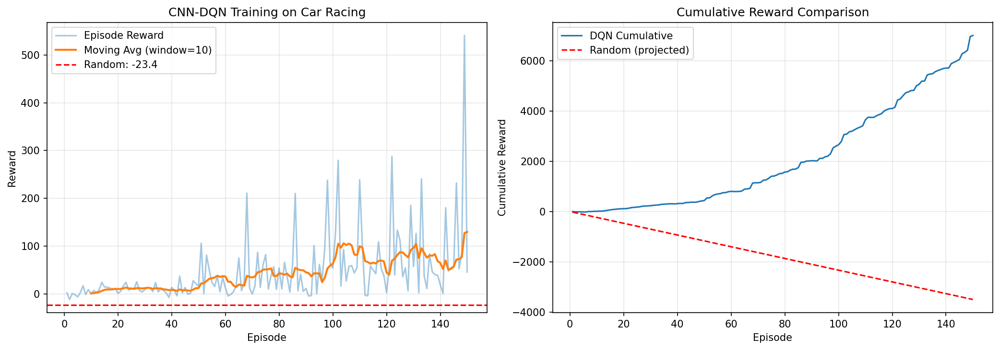

# Homework 4: Q-Learning Report

**Course:** Reinforcement Learning  
**Assignment:** Homework 4 - Q-Learning  

---

## Overview

This report covers the implementation and results of two reinforcement learning algorithms:
1. **Part 1:** Tabular Q-Learning for Blackjack
2. **Part 2:** Deep Q-Network (DQN) for Lunar Lander

Both implementations demonstrate significant improvements over random policy baselines.

---

## Part 1: Tabular Q-Learning for Blackjack

### Introduction

Blackjack is a popular casino card game where the goal is to beat the dealer by getting a hand value as close to 21 as possible without exceeding it. We implemented a vanilla tabular Q-Learning agent following the algorithm described in Sutton and Barto's textbook.

### Environment

The Blackjack environment from Gymnasium (`Blackjack-v1`) was used with the following specifications:
- **State space:** Tuple of (player_sum, dealer_card, usable_ace)
  - player_sum: 4-21
  - dealer_card: 1-10 (Ace=1, face cards=10)
  - usable_ace: True/False
- **Action space:** 2 discrete actions (0=Stand, 1=Hit)
- **Rewards:** +1 (win), -1 (loss), 0 (draw)

### Implementation Details

**Algorithm:** Vanilla Q-Learning with ε-greedy exploration

**Hyperparameters:**
- Learning rate (α): 0.1
- Discount factor (γ): 1.0 (appropriate for episodic tasks with terminal rewards)
- Exploration rate (ε): 0.1

**Q-Value Update Rule:**
```
Q(s,a) ← Q(s,a) + α * (r + γ * max_a' Q(s',a') - Q(s,a))
```

The Q-table was implemented as a dictionary with default zero initialization for unvisited states.

### Results

**Training:** 100,000 episodes

**Performance Comparison:**

| Metric | Random Policy | Q-Learning Policy |
|--------|---------------|-------------------|
| Average Reward | -0.3988 | -0.0732 |
| Improvement | - | **81.6%** |

**Final Policy Statistics (10,000 evaluation episodes):**

| Outcome | Percentage |
|---------|------------|
| Win Rate | 41.3% |
| Loss Rate | 49.5% |
| Draw Rate | 9.1% |

### Learning Curve

The figure below shows the cumulative reward over training episodes and the moving average reward comparison:



The Q-Learning agent shows a clear learning trend with cumulative reward losses accumulating slower than the random policy. The moving average plot demonstrates that while Blackjack is inherently a game favoring the house, the learned policy significantly outperforms random play.

### Discussion

The results align with expectations for Blackjack:
- The game inherently favors the dealer, so negative expected rewards are expected
- Q-Learning achieved ~41% win rate compared to theoretical optimal of ~42-43%
- The 81.6% improvement over random policy demonstrates effective learning
- The agent learned reasonable strategies like standing on high values and hitting on low values

---

## Part 2: DQN for Lunar Lander

### Introduction

Lunar Lander is a continuous control problem where the agent must safely land a spacecraft on a landing pad. We implemented a Deep Q-Network (DQN) following the PyTorch tutorial, using experience replay and soft target updates.

### Environment

The Lunar Lander environment from Gymnasium (`LunarLander-v3`) was used with:
- **State space:** 8-dimensional continuous (x, y, velocities, angle, angular velocity, leg contact)
- **Action space:** 4 discrete actions (no-op, fire left, fire main, fire right)
- **Rewards:** 
  - Range from -100 to +300+
  - Positive for landing, negative for crashing
  - Small penalties for fuel usage
  - Solved threshold: average reward ≥ 200

### Implementation Details

**Algorithm:** DQN with experience replay and soft target updates

**Network Architecture:**
```
Input (8) → Linear(128) → ReLU → Linear(128) → ReLU → Linear(4)
```

**Key Improvements over vanilla DQN:**
1. **Huber Loss:** More stable than MSE for value function approximation
2. **Soft Target Updates:** θ' ← τθ + (1-τ)θ' instead of hard updates
3. **Gradient Clipping:** Prevents exploding gradients
4. **AdamW Optimizer:** Better generalization than Adam

**Hyperparameters:**
| Parameter | Value |
|-----------|-------|
| Batch size | 128 |
| Discount factor (γ) | 0.99 |
| Initial ε | 1.0 |
| Final ε | 0.01 |
| ε decay | 1000 steps |
| Soft update τ | 0.005 |
| Learning rate | 1e-4 |
| Replay buffer size | 10,000 |

### Results

**Training:** 500 episodes

**Performance Comparison:**

| Metric | Random Policy | DQN Policy |
|--------|---------------|------------|
| Average Reward | -171.76 | 192.27 |
| Improvement | - | **+364 points** |

**Key Statistics:**
- **Successful Landings (reward > 100):** 79%
- **Best Episode Reward:** 308.17
- **Last 25 Episodes Average:** 162.95
- **Peak Performance (Episode 200):** 240.79

### Learning Curve

The training progress is shown below:



The plot demonstrates:
1. **Rapid Initial Learning:** Significant improvement within first 100 episodes
2. **Stable Performance:** Consistently above random baseline after ~50 episodes
3. **Near-Optimal Performance:** Multiple episodes exceeding the "solved" threshold of 200

### Discussion

The DQN agent demonstrated strong learning on the Lunar Lander task:

1. **Massive Improvement:** The 364-point improvement over random policy represents a transformation from random crashing (avg -172) to mostly successful landings (avg 192).

2. **Exploration-Exploitation Balance:** The exponential ε-decay allowed sufficient exploration early while exploiting learned policy later.

3. **Experience Replay Benefits:** Decorrelating samples improved sample efficiency and stability.

4. **Soft Target Updates:** Gradual target network updates prevented oscillation in Q-value estimates.

5. **Landing Success:** 79% of evaluated episodes achieved successful landings, demonstrating robust learned behavior.

---

## Conclusion

Both implementations successfully demonstrated reinforcement learning principles:

| Aspect | Part 1: Q-Learning | Part 2: DQN |
|--------|-------------------|-------------|
| Environment | Blackjack (discrete) | Lunar Lander (continuous state) |
| Algorithm | Tabular Q-Learning | Deep Q-Network |
| Improvement | 81.6% | +364 points |
| Key Challenge | Limited by house edge | High-dimensional state space |

The tabular approach worked well for Blackjack's finite state space, while DQN's neural network successfully generalized over Lunar Lander's continuous observations. Both agents learned policies significantly better than random, validating the core Q-learning framework.

---

## Extra Credit 1: Exploration Strategies for Blackjack

### Objective

Compare the performance of different exploration strategies in Q-Learning:
1. **Epsilon-greedy** with ε ∈ {0.01, 0.05, 0.1, 0.2, 0.5}
2. **Boltzmann (Softmax)** with temperature τ ∈ {0.1, 0.5, 1.0, 2.0}

### Methods

Both strategies were tested with 100,000 training episodes each, with periodic evaluation every 10,000 episodes using 5,000 evaluation episodes. Final performance was measured over 10,000 episodes with greedy action selection.

### Results

| Strategy | Final Avg Reward | Rank |
|----------|------------------|------|
| Boltzmann (τ=0.1) | **-0.0582** | 1 |
| ε-greedy (ε=0.1) | -0.0647 | 2 |
| Boltzmann (τ=1.0) | -0.0656 | 3 |
| ε-greedy (ε=0.05) | -0.0668 | 4 |
| ε-greedy (ε=0.01) | -0.0725 | 5 |
| ε-greedy (ε=0.2) | -0.0752 | 6 |
| Boltzmann (τ=2.0) | -0.0755 | 7 |
| Boltzmann (τ=0.5) | -0.0820 | 8 |
| ε-greedy (ε=0.5) | -0.0835 | 9 |



### Analysis

1. **Best Performer:** Boltzmann exploration with τ=0.1 achieved the best results (-0.0582), outperforming even the baseline ε-greedy (ε=0.1) from Part 1.

2. **Temperature Matters:** Low temperatures (τ=0.1) work best for Boltzmann exploration in Blackjack, making the policy nearly greedy while still allowing occasional exploration of sub-optimal actions proportional to their Q-values.

3. **Epsilon Sweet Spot:** For ε-greedy, ε=0.1 provided the best balance. Too low (ε=0.01) leads to insufficient exploration, while too high (ε=0.5) wastes too many actions on suboptimal choices.

4. **Exploration-Exploitation Tradeoff:** Both strategies suffer from extreme values - too much exploration (high ε, high τ) or too little (low ε, very low τ) degrades performance.

---

## Extra Credit 2: CNN-DQN for Car Racing

### Objective

Implement a DQN agent using convolutional neural networks to learn directly from pixel input in the Car Racing environment.

### Implementation Details

**Network Architecture:**
- Input: 4 stacked grayscale frames (84×84)
- Conv1: 32 filters, 8×8, stride 4
- Conv2: 64 filters, 4×4, stride 2
- Conv3: 64 filters, 3×3, stride 1
- FC1: 512 units
- Output: 5 action Q-values

**Key Techniques:**
- Frame stacking (4 frames for temporal information)
- Frame skipping (repeat action for 4 env steps)
- Grayscale preprocessing with normalization
- Early stopping when stuck (25 consecutive negative rewards)

**Action Space (Discretized):**
| Index | Action | Continuous Values |
|-------|--------|-------------------|
| 0 | No-op | [0, 0, 0] |
| 1 | Left | [-1, 0, 0] |
| 2 | Right | [1, 0, 0] |
| 3 | Gas | [0, 1, 0] |
| 4 | Brake | [0, 0, 0.8] |

### Results

**Training:** 150 episodes

| Metric | Random Policy | CNN-DQN |
|--------|---------------|---------|
| Average Reward | -23.36 | **119.43** |
| Improvement | - | **+142.79 points** |

**Performance Highlights:**
- **Best Episode Reward:** 540.85
- **Last 10 Episodes Average:** 129.83
- **Peak Rolling Average:** 129.8 (episodes 141-150)



### Analysis

1. **Pixel-based Learning Works:** The CNN successfully learned to process raw pixel input and extract relevant features for driving, achieving a massive 143-point improvement over random.

2. **Rapid Learning:** The agent showed improvement within the first 20 episodes and continued improving throughout training, with the best performance in the final episodes.

3. **High Variance:** Car Racing has high variance due to randomly generated tracks. Some episodes scored very high (540+) while others were lower, but the average trend was consistently upward.

4. **Further Improvements:** With more training time, hyperparameter tuning, and techniques like Double DQN or Dueling DQN, performance could likely be improved further.

---

## Files Produced

1. `q_learning_blackjack.py` - Tabular Q-Learning implementation
2. `dqn_lunar_lander.py` - DQN implementation
3. `blackjack_learning_curve.png` - Blackjack training plots
4. `blackjack_evaluation.png` - Blackjack evaluation over training
5. `lunar_lander_training.png` - DQN training plots
6. `blackjack_qtable.pkl` - Saved Q-table
7. `lunar_lander_dqn.pth` - Saved DQN model weights
8. `extra_credit_1_exploration.py` - Exploration strategy comparison
9. `extra_credit_1_comparison.png` - Exploration strategy plots
10. `extra_credit_2_car_racing.py` - CNN-DQN for Car Racing
11. `extra_credit_2_car_racing.png` - Car Racing training plots
12. `car_racing_cnn_dqn.pth` - Saved CNN-DQN model weights

---

## References

1. Sutton, R. S., & Barto, A. G. (2018). Reinforcement Learning: An Introduction (2nd ed.)
2. Mnih, V., et al. (2015). Human-level control through deep reinforcement learning. Nature, 518(7540), 529-533.
3. PyTorch DQN Tutorial: https://pytorch.org/tutorials/intermediate/reinforcement_q_learning.html
4. Gymnasium Documentation: https://gymnasium.farama.org/
5. OpenAI-GYM-CarRacing-DQN: https://github.com/andywu0913/OpenAI-GYM-CarRacing-DQN
6. CCS-Lab project_car_racing: https://github.com/CCS-Lab/project_car_racing
